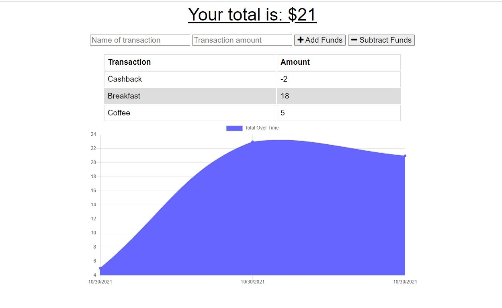

# Application - Budget Tracker (With Online/Offline Support)

The Budget Tracker application allows users to add transactions to the Budget Tracking database. It allows offline feaures such as allowing users to add expenses and deposits to their budget with or without a connection. When entering transactions offline, they populates the total when brought back online.

Offline Functionality:

  * Enter deposits offline
  * Enter expenses offline

When brought back online:

  * Offline entries should be added to tracker.

## Business Context

Giving users a fast and easy way to track their money is important, but allowing them to access that information anytime is even more important. Having offline functionality is paramount to our applications success.

## Acceptance Criteria
GIVEN a user is on Budget App without an internet connection
WHEN the user inputs a withdrawal or deposit
THEN that will be shown on the page, and added to their transaction history when their connection is back online.

- - -

## Deployment Details

The Budget Tracker is deployed to Heroku and uses the MongoDB Atlas. 

* The URL to the deployed application [Budget Tracker Application](https://lit-temple-86914.herokuapp.com/) 

* The URL to the GitHub repository [Budget Tracker Code](https://github.com/nataliapost11/hw-pwa-budget-tracker/) 
